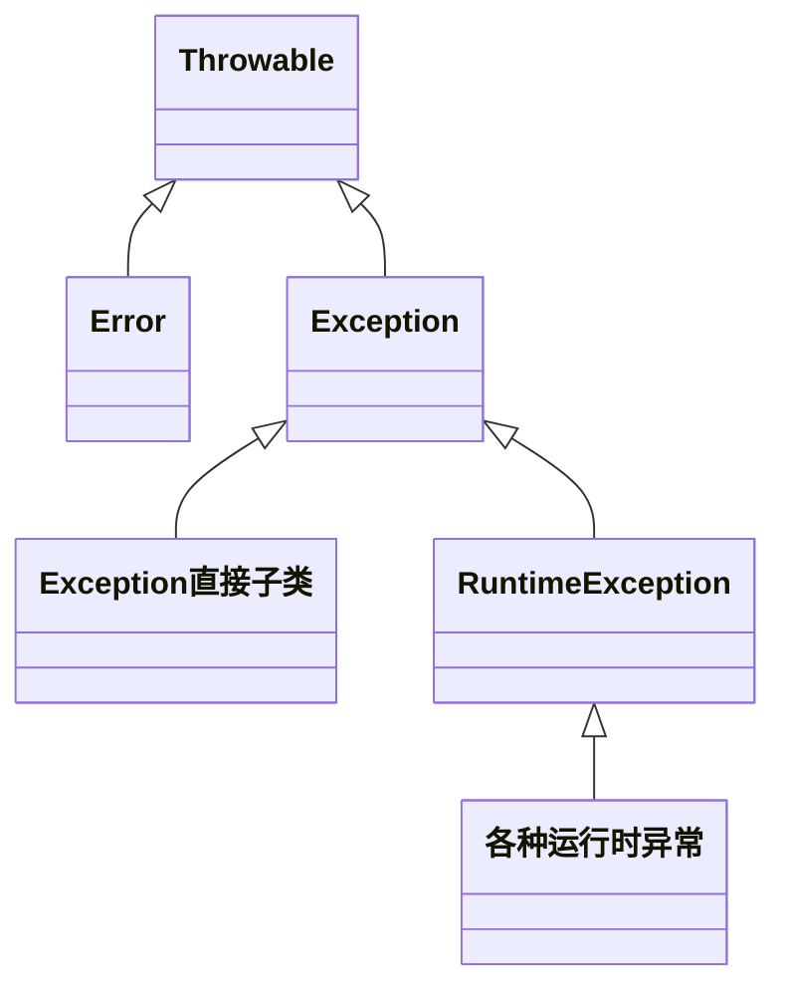

## Final类

+ final 修饰类不可继承 如String类
+ final 修饰方法不可被覆盖和重写
+ final 修饰**变量**只可以被赋一次值
  + 如`final int a; a=3;`也可
  + 如修饰一个引用则不能修改指向的地址，但内容可修改
  + 如果是**实例变量**必须在默认**构造器**中必须手动赋值也行
  + 实例变量`final`一般和`static`连用，一般也是`public`的~P493~

## 抽象类

+ 编译和运行阶段的方法是不同的，运行阶段是**具体实现类**的，编译阶段是**抽象类**的~P497~

## 接口

+ 接口可以**多重继承接口**
+ 接口中只包含**常量**和**抽象方法**
+ 接口中所有内容都是**公开的**，常量可以省略`public static final` 抽象方法可以省略`public abstract`~p508~
+ 接口可以将**调用者**和**实现者**解耦合
+ 类之间关系：
  + is a：继承关系 has a：关联关系 like a：实现关系
+ 接口一般是对**行为**的抽象

## 包

+ 当引入了包以后，在编译时应当使用-d编译参数 `javac -d . *.java`进行带包编译~p518~
+ 用命令行运行时候要使用完整的类名
+ 引入包之后用java命令执行类时候需要将类**所在包名**也加上如`java com.innky.HelloWorld.class`
+ 在同一包内的类不需要import，不同包内需要import
+ import是为了让使用类的时候不用打带包名的全称，如果不import其实也可以用全称访问
+ java.lang包下的类不需要import（不含子包）

## 访问控制权限

+ private只能在本类中访问
+ 默认 在本类和同包下
+ protected在本类、同包、子类中
+ public任何位置访问

本类——同包——子类——任何位置

public > protected > 默认 > private

## Object类

+ toString方法：建议所有类重写该方法~p527~
+ equals方法：
  + 重写前比较的是地址，重写后比较内容
  + 重写时可以先判空、判类型、判地址是否相等，之后需要**向下转型**
  + 重写时若类成员有引用类型，则在比较时也要调用其equals方法（如String类）不要用==~p536~
  + equals得重写彻底
+ finalize方法：
  + 即将被垃圾回收器回收时会被调用（由gc调用）
  + 为protected，默认方法体为空
  + jdk9后弃用
  + System.gc()建议启动垃圾回收
+ hashCode 对象地址经过哈希算法 底层为native调用c++
+ clone方法 底层native调用c++

## 匿名内部类

>  内部类分为静态、实例、局部内部类

## 数组

+ 数组不是基本数据类型,为引用,父类是Object,存储在堆中

+ 每个数组对象都有length属性

+ 静态初始化`int[] i = {1,2,3}`动态初始化 `String[] s = new String[5];`

  ```java
  Object o1 = new Object();
  Object o2 = new Object();
  Object o3 = new Object();
  Object[] os = {o1, o2, o3};
  ```

+ 数组作为参数的特殊情况

```java
printArray(new int[10]);
printArray(new int[]{1,2,3});
printArray({1,2,3})//错!!!!!
```

+ 数组扩容:
  + 使用数组拷贝`System.arrayCopy(src,srcPos,dest,destPos,len)`~p557~
  + 以上方法为浅拷贝，只拷贝地址
+ java.utils.Arrays提供了数组相关操作的实现~577~

## 排序查找算法p577~582

---

## String类

+ 本身由final修饰，不可被继承
+ 用双引号括起来的字符串都存储在**方法区**的**字符串常量池**中
+ new String("asdasd")创建对象时在**堆**中创建，但数据部分仍**指向**常量池
+ 常用构造方法：String(Byte[] bytes)、String(Char[] chars)
+ String内部是一个Bytes数组并且**由final修饰**
+ 常用方法~p603~：
  + charAt() contains() endsWith() startsWith() equalsIgnoreCase() getBytes() isEmpty() toLowerCase()
  + indexOf()  lastIndexOf()  replace() split() subString() toCharArray()
  + match() 匹配正则表达式 replaceAll() 以正则匹配替换
  + length() --字符串对象没有length属性，要调length方法
  + compareTo()比较，相当于python中>符号比较，比大小
  + trim()去除前后空格
  + String.valueOf()将其他类型的对象转换成字符串

## StringBuffer

+ **频繁的进行字符串拼接**会给字符串常量池造成很大的压力
+ 建议使用StringBuffer、StringBuilder
+ 默认内部用Byte数组存储，默认容量为16,使用的时候尽量分配一个适当的大小，减小底层扩容次数
+ 用append追加字符串（满了会自动扩容）
+ 为什么可变？
+ 与StringBuilder的区别：
  + StringBuffer有synchronized关键字修饰，是线程安全的
  + StringBuilder没有synchronized关键字修饰，非线程安全的

## 包装类

+ 8种包装类，属于引用，父类为Object
+ 自动装箱，自动拆箱（可以直接互相赋值）
  + 只有进行运算时会触发自动拆箱，==不会触发因此

```java
Integer a = 1000;
Integer b = 1000;
System.out.print(a == b);//为false，因为是引用类型


Integer a = 127;
Integer b = 127;
System.out.print(a == b);//true，内存地址相同 -128~127为整型常量池

```


+ 方法
  + valueOf()
  + Integer.parseInt()
  + Integer.toBinaryString()  Integer.toHexString()


## 日期

+ Date无参构造方法返回精确到毫秒的当前时间,有参（传入时间戳）
+ 日期格式化
  + sdf = new SimpleDateFormat("yyyy-MM-dd HH:mm:ss SSS")
  + sdf.format(date)->String
  + sdf.parse(string)->Date
+ System.currentTimeMills() 返回当前时间戳~621~

## 数字格式化

+ DecimalFormat("#代表任意数字 ，千分位  .小数点 0不够补充零")
+ "###,###.####"

## BigDecimal类

> 精度高的大数，是引用对象

+ 操作不能直接用+-*/要调方法

## 随机数

+ new Random()
+ random.nextInt(bound) bound为上界（不包含）

## 枚举enum

> 当返回值的情况可以被列举出来时候，可以使用枚举类型，如状态等变量

+ 枚举编译后后也是常class文件
+ 是引用类型，每一个值可看成常量
+ switch支持枚举，case中不用带枚举名（类名）

## 异常

+ 以类形式存在，可以new创造对象
+ 都继承自Throwable,分支为Error（不可处理） 和Exception（可处理）
+ Exception分为其直接子类（编译时异常）和运行时异常
  + 编译时异常必须在编写程序时必须预先处理（否则报错）---也称受检（控）异常
  + 运行时异常可处理也可不处理                                            ---也称非受检（控）异常
  + 所有异常都发生在运行阶段



+ 若异常一路上抛给main，main上抛给jvm则程序终止运行
+ 处理异常时可以处理该类及其**父类**
+ throw new Exception()手动抛出异常
+ 方法体若出现异常上抛，则后面的代码不执行~644~
+ 
+ jdk8
+ getMessage()获取构造方法中传的消息
+ 
+ 
+ 
+ 
+ 
+ 
+ 
+ 
+ 
+ 
+ 

## 集合

+ 集合任意时刻存储的都是引用，不能存储基本数据类型
+ 所有的集合类和接口都在java.util包下
+ 分为单个元素的（继承自Collection）和键值对型的（继承自Map）

### 继承关系

#### Collection系列


+ ArrayList非线程安全，Vector线程安全 但效率低，不常用
+ HashSet底层是一个HashMap TreeSet底层是TreeMap

#### Map系列 


#### 总结


### Collection

+ 方法

  + add() size() remove() isEmpty() toArray()
  + 没有length
  + iterator()

    + 最初并没有指向第一个元素
    + 有两个方法hasNext() next()
    + while(it.hasNext()){it.next();}
    + 集合结构一旦发生改变则迭代器必须重新获取，不然调用next()方法时会出异常
    + 删元素时候需要使用迭代器的remove()方法
  + Set在add()的时候如果加了重复的元素并不会报错
  + contains()
    + 底层是**调用的equals方法**不是简单的比较内存地址
    + remove()等许多方法底层也是调用的equals方法
    + 因此放在Collection里面的要重写equals方法~p676~

#### List子接口

+ add()默认向末尾加元素，add(i,obj)向i位置添加元素，剩余元素移位
+ get(index) set() indexOf() lastIndexOf()最后一次出现的索引
+ remove(index)**?疑问，如果存储的是int呢？**
+ **ArrayList**
  + 初始化容量10，有参构造int指定初始化容量**（初始化0，加第一个元素时候扩容为10）**
  + 底层是数组，每次扩容变成**1.5倍容量**，尽量减少扩容次数
  + 有参构造传Collection构造
+ **LinkedList**
  + 底层双向链表，随机增删元素的效率较高
+ **Vector**
  + 初始化10每次扩容变成两倍
  + 线程安全，但效率低
+ 将ArrayList**转化成线程安全**的 **Collections.synchronizedList(myArrayList)**

#### Set子接口

+ 无序不可重复
+ 分为HashSet 和TreeSet(元素自动排序)

### 泛型

+ jdk5引入，跟在类名后面 `List<Animal> list = new ArrayList<Animal>();`
+ 使用泛型取数时不需要转型，但元素多样性受限；
+ JDK8后存在**钻石表达式**可以省略一些东西`List<Animal> list = new ArrayList<>();`
+ 自定义泛型在类名处加`MyClass<E> MyClass<T>`
  + 如果写了泛型但创建对象时没有用，则泛型为Object

### 增强For循环

+ for (ElemType item : list){}
+ 在idea中可以直接 list.for回车调出~p696~

### Map

+ 常用方法
  + put() get() clear() containsKey() containsValue() isEmpty() 
  + keySet() values() remove() size() 
  + Set<Map.Entry<K,V>> entrySet()将map集合转成set集合
+ **遍历**
  + 通过keySet()，遍历key取value 每次都进行查找效率低
  + **通过entrySet()**，每次getKey() getValue() 效率高

#### HashMap

+ 底层是一个一维数组，每个元素是一个链表
+ 非线程安全
+ 即拉链法建立的散列表
+ 底层会调用key的equals()和hashCode()
+ **HashMap的  key  必须重写equals()和hashCode()**
+ **HashSet中的元素 必须重写equals()和hashCode()**
+ 散列分布不均：
  + 所有hashCode一样则退化为单链表
  + 所有hashCode都不一样则退化为数组
+ HashMap默认初始化容量为16（建议是2的倍数），默认加载因子为0.75(当容量达到0.75时开始扩容)每次扩容容量乘2
+ **equals如果重写了，hashCode也要重写**，且equals为true两个对象hashCode必须相等，IDEA可以自动一起生成
+ JDK8后当链表元素**大于8会**自动转成**树**，小于6变回单链表

#### HashTable

+ 线程安全，一般不用
+ HashMap  的key可**以为**空，也可以通过null取值
+ HashTable的key和value都**不可以**为空
+ HashTable初始化11，因子0.75， 扩容*2+1

#### Properties

+ 线程安全
+ key和value都是String的HashTable
+ 存setProperty()取getProperty()

#### TreeMap/Set

+ 存进去取出来就升序
+ 要存进TreeSet中的元素必须**实现Comparable**接口
+ 也可以**实现一个Comparator接口**，但在TreeSet构造方法中需要传进去
  + 如果比较的规则**不变**则使用    Comparable接口
  + 若比较的规则经常**改变**则使用 Comparator接口
+ 传入**比较器**优先级高于**类中重写的compareTo方法，因此对于Integer可以通过传比较器改变规则

Collection**s**工具类

+ synchronizedList()
+ sort()~需要实现Comparable~        ~p716~

##   IO流

+ 分类

  + 方向：读和写，输入流和输出流
  + 读取方式：字节流和字符流
    + 以Stream结尾为字节流
    + 以Reader/Writer结尾为字符流

+ 四大家族

  + java.io.InputStream
  + java.io.OutputStream
  + 

+ 所有的流都可以关闭，用完流都要关闭

+ 所有的输出流都实现了Flushable接口，在完成最后输出后最好调用flush一下

+ 主要的流

  


### FileInputStream

+ 标准流程

```java
FileOutputStream fileOutputStream = null;
try {
    fileOutputStream = new FileOutputStream("a.txt");
    //进行读写操作的区域
    //。。。
} catch (FileNotFoundException e) {
    e.printStackTrace();
}finally {
    if (fileOutputStream == null) {
        try {
            fileOutputStream.close();
        } catch (IOException e) {
            e.printStackTrace();
        }
    }
}
```

+ read()读取一个字节，读到末尾返回 -1

+ read(byte[] buffer) 返回值为**读取到的字节数量**，没读到返回**-1**

+ 

+ 读文件模板

  

+ 其他常用方法

  + available()返回剩余未读字节数量（初始时候可以获取总字节数量）
  + skip(int k)跳过几个字节

### FileOutputStream

+ 写完之后要刷新flush()
+ write() write(bytes) write(bytes,off,len)
+ 构造方法处**可以传入append=true**追加模式

### 文件拷贝

+ 多个文件close时要分开try，否则一个文件出异常会影响另一个文件close

### FileReader/FileWriter

+ 只能读/写文本 将byte改成char,其他基本与FileInput/OutputStream一样
+ fileWriter.write()可以直接写String文件~p738~

### BufferedReader~p738~

+ 自带缓冲区

+ 节点流和包装流

  + 是相对的，多层包装的时候

+ 对于包装流，只需关闭最外层的流，内层为自动关闭

+ 直接调用bufferedReader.readLine()读一行 返回String 读到末尾返回null

+ InputStreamReader为转换流，将字节流转换为字符流

### DataOutputStream

+ 是包装流，传入OutputStream类
+ writeByte() writeInt() ......
+ 用DataInputStream读取，并且读取的顺序为写入的顺序

### PrintStream

+ 标准输出流，System.out就是该类
+ 可以调用System.setOut(printStream)设置输出方向

### File类

+ 常用方法
  + exists() createNewFile() mkdir()创建目录 mkdirs()递归创建目录 delete()
  + getParent() getParent() getAbsolutePath() getName() isDirectory() isFile()
  + lastModified()返回时间戳 length()
  + listFiles()

### ObjectInput/OutputStream~p749~

+ 序列化Serialize与反序列化DeSerialize

+ writeObject()进行序列化，readObject反序列化  

+ 待序列化对象需要**实现Serializable**接口，接口为**标志接口**，接口中方法**为空**

+ **transient关键字**修饰的属性不参与序列化

+ 序列化版本号：

  + java虚拟机首先通过类名区分类，同一个类的不同的版本通过序列化版本号区分

+ 实现Serializable接口的类最好手动指定序列化版本号

  ```java
  private static final long serialVersionUID = 10; 
  ```

### IO+Properties

+ 使用Properties实例的load()方法加载配置文件

## 多线程

+ java程序至少有两个线程：主线程以及垃圾回收线程
+ 线程共享：
  + **堆内存**和**方法区内存**共享
  + **栈内存**独立，一个线程一个栈
+ 实现多线程：
  + 继承java.lang.Thread 重写run~p764~
  + 实现java.lang.Runable
+ 方法
  + 线程对象.setName() getName()
  + Thread.currentThread()获取当前线程对象（静态方法）


### 阻塞

+ Thread.sleep(millis)**当前**线程休眠（静态方法）
+ t.interrupt()强行唤醒t的睡眠（出异常）
+ t.stop()强行终止线程（已过时）
  + 正常方式，设一个run的flag变量 循环中去判断

### 调度

+ java是基于优先级的线程调度
+ t.setPriority(int)   t.getPriority()
  + 优先级最大10 最小1 默认是5
+ yield()让位方法 从运行进入就绪
+ t.join()合并线程：将当前线程阻塞，t执行完成再继续（相当于t插入到当前线程中）

### 线程同步

+ 数据安全问题

  

+ 编程模型：

  + 异步编程模型-》并发
  + 同步编程模型-》排队

+ 使用**线程同步机制**：

  ~p787~
  
+ synchronized括号内部写需要互斥的线程所共享的线程

  + 每个对象都有锁，当进入临界区时会申请该对象的锁
  + 相当于临界区前p一下共享对象，临界区后v一下

+ **局部变量不会**有线程安全问题，因为局部变量在栈中，不共享

+ **常量** **不会**有线程安全问题

+ **静态变量**在方法区，**实例变量**在堆中，**可能**存在线程安全问题

+ 同步代码块**越小**效率越高

+ synchronized出现在**实例方法**上

  + 锁的对象是this，不灵活
  + 整个方法都同步，扩大同步范围

+ synchronized出现在**静态方法**上

  + 类锁，一个类只有一把

+ 局部变量建议使用StringBuilder不会出现线程安全问题

+ 死锁

  

### 解决线程安全

+ 尽量使用局部变量代替实例变量和静态变量
+ 如果必须是实例变量，可以考虑创建多个对象（即对象不共享）
+ 如果以上都不行，只能使用synchronized

### 守护线程

> 后台线程，守护线程一般是死循环，所有的用户线程结束则守护线程自动结束

+ 线程分为用户线程和守护线程
+ 通过myThread.setDaemon(true)设置守护线程

### 定时器

+ java.util.Timer 实际开发较多使用SpringTask
+ 构造方法Timer(name,isDaemon)
+ timer,schedule(Timertask,Date firstTime,mills);

### Callable接口

实现线程的第三种方法，jdk8加入

+ 创建new FutureTask(new Callable(){})
+ new Thread(futureTask) myThread.start()
+ 通过t.get()得到线程的返回值但会**阻塞**当前线程

### wait和notify

+ 是Object对象的方法~p807~
+ ？？？

## 反射机制

>  通过反射机制操作字节码文件class文件

+ 相关类
  + java.lang.Class 整个字节码
  + java.lang.reflect.Method 方法字节码
  + java.lang.reflect.Constructor 构造方法字节码
  + java.lang.reflect.Field 属性字节码

### Class

+ 获取Class实例
  + Class.forName("java.lang.String")静态方法，参数为完整类名
  + object.getClass()实例方法
  + 类名.class
+ class实例.newInstance()方法获取一个新的实例，会调用**无参构造方法**，必须保证有无参构造
  + 不用改动源代码创建不同的实例对象，符合OCP开放原则（对拓展开放，对修改关闭）
+ Class.forName()方法的执行会导致类加载，静态代码块被执行
  + 如果只希望执行静态代码块，可以写这一句
+ 文件路径相关：
  + 默认相对路径的方式在IDEA中默认为工程的根，离开了idea可能就不能运行了
  + `Thread.currentThread().getContextLoader().getResource("从类的根路径开始的相对路径名").getPath()`
  + `Thread.currentThread().getContextLoader().getResourceAsStream("从类的根路径开始的相对路径名")`
    + 获取不到.java文件，因为在编译后.java变成.class文件了
  + 资源绑定器ResourceBundle
    + `ResourceBundle.getBundle("从类的根路径开始的路径，省略.properties后缀")`只能读取properties文件
    + `getString(key)`获取属性
+ 类加载器
  + 分类
    + 启动类加载器（父）
    + 拓展类加载器（母）
    + 应用类加载器
  + 
  + 双亲委派机制
+ getName() getSimpleName()
+ Class方法
  + getSuperClass() getInterfaces()


### Field

+ 获取Field
  + class.getField(string) class.getDeclaredField(string)
  + class.getFields() 获取所有的公开属性     class.getDeclaredFields()获取所有的属性
+ 方法
  + getName() getType() 
  + getModifiers()返回int
    + Modifier.toString(返回的值)将其转成字符串
  + field.set(object, value)给obj对象的field属性赋值
  + field.set(object)
  + field.setAccessable(true)**打破封装**，可以访问私有属性

### Method

+ 可变长度参数~p827~
  + void method(int...args)
  + 参数0到n个
  + 可变长在形参列表中只能出现**一个**且只能为**最后一个**
  + args自动转成一个数组，传入的时候也可以直接传入数组

+ 获取Method
  + getDeclaredMethods()
  + getDeclaredMethod(String name, Class...parameterTypes)
    + 获取特定方法不仅需要方法名，还需要参数列表（有重载）

+ 方法
  + getName() getReturnType() getModifiers() getParameterTypes()
  +  调用方法:4要素 对象 方法 参数 返回值
    + Object retValue= method.invoke(obj, Object...args)


### Consturctor

+ getDeclaredConstructors() 
+ getDeclaredConstructor(Class...parameterTypes)
+ 创建对象
  + constructor.newInstance(Object...args)

## 注解

+ 引用类型，编译生成.class文件

+ 定义

  ```java
  [修饰符列表] @interface 注解类型名{
     	属性类型 属性名() [defalt 默认值];   
  }
  ```

+ 几乎可以修饰任何东西

+ jdk内置注解

  + @Deprecated 可以修饰类、方法。。等等
  + @Override 标识性注解 编译阶段检查是否重写父类方法，只能放在方法上

+ 元注解，注解的注解

  + @Target(Elemtype.METHOD)指定被标注的注解可以出现在哪些位置上
  + @Retention(RetentionPolicy.???)指定被标注的注解所存储的位置
    + .Source:只被保留在Java原文件中
    + .Class:被保存在Class文件中
    + .Runtime:Class文件中且可以被反射机制读取

+ 注解定义属性

  + 没有默认值的属性必须在使用时指定属性值@注解类型名(属性名=值)
  + 如果属性名为value且只有1个属性，则在使用的时候属性名可以省略@注解名(值)
  + 属性类型：
    + 基本数据类型
    + String Class 枚举
    + 以上类型的数组形式
      + 使用时如果只有一个元素，则大括号可以省略

+ 反射注解

  + 判断是否存在注解
    + reflectObj.isAnnotationPresent(MyAnnotation.class)
  + 获取注解对象
    + MyAnnotation a = (MyAnnotation ) reflectObj.getAnnotation(MyAnnotation.class)
    + a.属性名称()访问属性


